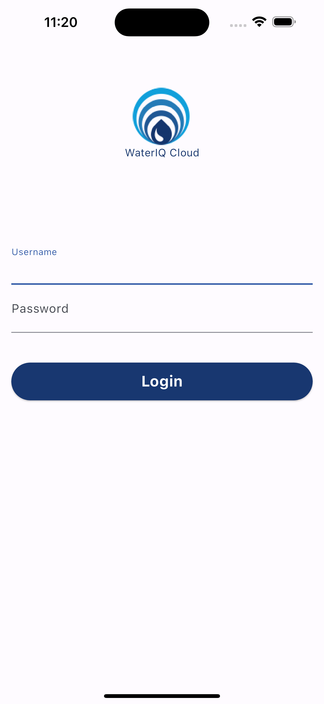

# WaterIQ Cloud Mobile

Flutter mobile app for WaterIQ Cloud. It provides a customer dashboard for units/sensors, charts, maps, and notifications backed by the WaterIQ Cloud API and Firebase messaging.

## What is in this repo

- Flutter app source in `lib/`
- Platform scaffolding in `android/`, `ios/`, `web/`, `macos/`, `linux/`, `windows/`
- Assets in `assets/`
- Firebase config in `firebase.json` and `lib/services/firebase/firebase_options.dart`

## Screenshot



## Requirements

- Flutter SDK (3.2+ recommended)
- Dart SDK (bundled with Flutter)
- Android Studio/Xcode for device or simulator builds

## Setup

1) Install dependencies:

```bash
flutter pub get
```

2) Configure Firebase (if you need to regenerate options):

```bash
flutterfire configure
```

3) Run the app:

```bash
flutter run
```

## Notes

- API base URL is defined in `lib/services/wiqc_api_services/api_url.dart`.
- Firebase Cloud Messaging setup lives in `lib/services/firebase/`.

## License

Internal use only. Add a license if you plan to distribute the code.
